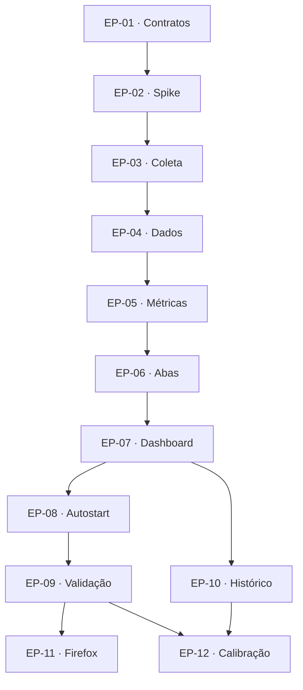

# DigitalMirror — backlog publicado

[Project privado](https://github.com/users/UnicHeld/projects/2) · [Issues públicas](https://github.com/UnicHeld/digitalmirror/issues)

## 7. Backlog do GitHub Project

Project: **DigitalMirror — Presença Digital Pessoal**, privado, na conta `UnicHeld`. Repositório **UnicHeld/digitalmirror**, público. Os épicos estão publicados como issues #1–#12 e vinculados ao Project.

Campos: Status (`Backlog`, `Ready`, `In Progress`, `Review`, `Done`), Prioridade (`P0`, `P1`, `P2`), Fase (`M0`, `M1`, `M2`), Spec ID e Dependências. Os IDs EP-xx são estáveis; nesta publicação EP-01 corresponde à issue #1, e assim por diante até EP-12 / #12. Cada corpo de épico inclui as histórias e critérios que devem acompanhar sua publicação.

M0 = spike e contratos. M1 = versão utilizável completa em Chrome/Chromium, incluindo autostart e dashboard. M2 = Firefox, histórico avançado e calibração. Não estabelecer datas fictícias sem medir o spike; ordenar por dependência.

Execução vigente: **Docker/Compose obrigatório** para desenvolvimento, CI,
diagnóstico e futuro runtime (ADR-007). Issues #1/#2/#8/#9 sincronizadas com
entregas, pendências e essa estratégia. Commit `0a552a5` publicado na main;
[CI via Compose](https://github.com/UnicHeld/digitalmirror/actions/runs/37550585612)
passou em Python 3.11/3.13. Project atualizado: EP-01 Done, EP-02 In Progress;
demais épicos permanecem no Backlog.

### EP-01 · [#1](https://github.com/UnicHeld/digitalmirror/issues/1) — Contrato do produto e base SDD

**Prioridade:** P0 · **Fase:** M0 · **Spec:** 001 · **Dependências:** nenhuma.

**Objetivo:** como usuário, quero regras documentadas e exemplos reproduzíveis para entender o que cada número significa.

**Histórias/tarefas:**

- [x] US-01.1 — Versionar spec, plan, tasks e estrutura de ADRs.
- [x] US-01.2 — Fixar contrato de estados, unidades, qualidade e política de privacidade.
- [x] US-01.3 — Criar fixtures dos casos de jornada e critérios de conclusão.

Evidência publicada: `specs/001-foundation/`, `docs/requirements.md`, `docs/adr/`,
16 casos em `tests/fixtures/workday-cases.json` e CI por descoberta. Testes/checks
executados via Docker Compose, localmente e na CI Python 3.11/3.13.
Checklist concluído, issue #1 encerrada e status Done no Project.

**Aceite:** documentos incluem 09–18, almoço de 1h, fórmulas distintas de presença/interação, gaps e limites de inferência. Cada RF/RNF possui épico responsável. CI verifica schema das fixtures e testes do motor quando implementado. Nenhuma credencial ou telemetria pessoal faz parte dos exemplos.

### EP-02 · [#2](https://github.com/UnicHeld/digitalmirror/issues/2) — Spike de viabilidade no Debian/X11

**Prioridade:** P0 · **Fase:** M0 · **Spec:** 002/006 · **Dependências:** EP-01.

**Objetivo:** como usuário, quero confirmar que os sinais funcionam na minha sessão antes de investir no dashboard.

**Histórias/tarefas:**

- [x] US-02.1 — Comando `doctor` verifica X11, propriedades de foco, idle, D-Bus e monitores.
- [ ] US-02.2 — Spike valida bloqueio, desbloqueio, suspensão e retomada reais.
- [ ] US-02.3 — Spike mede custo de polling e integração de autostart com GNOME.
- [ ] US-02.4 — Prova de correlação navegador/X11 com duas janelas e perfis.

Status In Progress no Project: comando doctor, medidor finito e watcher de sinais publicados,
com testes sintéticos e diagnóstico real de logind. Ensaios gráficos e aceite final
pendentes; veja `docs/spike-ep02-report.md`. US-02.1 concluída como diagnóstico e
relatório de fontes; US-02.2/03/04 permanecem pendentes.
Continuação publicada no commit `dfe2a24`: ADR-008 resume ciclos ordenados,
duplicatas e sinais sem par; ADR-009 torna XDG_SESSION_ID opcional, com LockedHint
indisponível e sem buscar outra sessão. [CI via Compose](https://github.com/UnicHeld/digitalmirror/actions/runs/37553831948)
passou em Python 3.11/3.13 com 40 testes, imagens dev/runtime e build. Issue #2
e Project sincronizados. Evidências posteriores fornecidas pelo usuário via
Compose: dez fontes read-ok nas 12 amostras/5s; CPU de 1,137% acima da referência
RNF-03 de ≤1%. Watcher de 120s recebeu dois ciclos GNOME completos durante ensaio
manual Windows+L; quantidade de ações ainda precisa ser correlacionada. LockedHint
ausente. Ensaio posterior de 180s com suspensão/retomada manual recebeu um ciclo
completo PrepareForSleep e um GNOME, sem duplicatas/bordas pendentes; o comando
gerou JSON após retorno. Fontes após retomada e comparação de lock ainda precisam
ser verificadas. US-02.2 parcial; US-02.3/04 e C0 continuam pendentes.
ADR-010 implementa resolução validada por ID explícito/User.Display do UID real,
consultas de lock durante watcher e revalidação após pares de retomada/fim.
53 testes/checks/build via Compose passaram localmente e CI Python 3.11/3.13 passou.
Primeiro doctor real da versão nova: dez fontes read-ok, logind-lock indisponível
por session-identity-mismatch. Atributo divergente desconhecido; investigar com
diagnóstico sanitizado antes dos watchers novos. Não encerra US-02.2/03/04 nem C0.

Atualização de 07/10/2026: instrumentação sanitizada confirmou candidato por
User.Display, com Id/UID/Type/Class/Remote válidos e Session.Display vazio como
única comparação rejeitada. Mantidos os critérios do ADR-010, sem enumeração ou
consulta LockedHint de candidato não validado. Checks via Compose/Python 3.11:
formatter, lint, mypy, 57 testes e build aprovados.

Etapa 1 aceita no escopo finito do spike: um bloqueio/desbloqueio manual Windows+L
correlacionado ao ciclo GNOME e estados true/false; suspensão/retomada manual
correlacionada a um par PrepareForSleep, com revalidação e recuperação final das
fontes. Foco vazio na consulta imediata de retomada permanece registrado.
LockedHint acessível em consulta direta no host não comprova associação ao X11
nem transições; naquele ensaio o doctor rejeitava Session.Display vazio. Comparação
de fontes e decisão final de adaptadores seguem pendentes em US-02.2.
Precisão de foco/monitores, dois perfis, login/logout/instância única e custo de
polling ainda precisam de validação. EP-02 In Progress, EP-03 Backlog e C0 pendente.

Complemento local ADR-011 após evidência de VT coincidente no host/Compose:
associação exclusivamente com Display vazio, cinco critérios válidos, VT/seat0/
atividade e releituras consistentes do mesmo candidato. Formatter/lint/mypy,
67 testes e build via Compose aprovados. Doctor real às 01:28:39 UTC de 08/10
(22:28:39 local de 07/10) confirmou onze fontes read-ok, associação x11-vt e
LockedHint=false coincidente com GNOME=false nessa leitura. Display continua vazio.
Transições LockedHint e custo das consultas extras ainda pendentes; não encerra
EP-02 ou C0.

**Aceite:** relatório de fontes disponíveis e ausentes, precisão observada e custo básico. Diagnóstico é só leitura, sem mover foco ou gerar entradas. As fontes indisponíveis têm fallback definido ou estado desconhecido. Evidência do alvo real registrada sem conteúdo pessoal.

### EP-03 · [#3](https://github.com/UnicHeld/digitalmirror/issues/3) — Coleta passiva de sessão e aplicação

**Prioridade:** P0 · **Fase:** M1 · **Spec:** 002 · **Dependências:** EP-02.

**Objetivo:** como usuário, quero ver em qual aplicação estive e os estados da minha sessão.

**Histórias/tarefas:**

- [ ] US-03.1 — Capturar app/PID/foco com polling de 5s e eventos disponíveis.
- [ ] US-03.2 — Classificar ACTIVE/LOW_ACTIVITY/IDLE pelos limiares configurados.
- [ ] US-03.3 — Capturar lock/unlock/sleep com origem e qualidade.
- [ ] US-03.4 — Associar monitor/workspace e tratar reconexão do X11.

**Aceite:** teste terminal → navegador → IDE atribui duração dentro da precisão documentada. Bloqueio/suspensão não recebem tempo de app. Falha em app preserva estado válido da sessão; falha crítica cria UNKNOWN. Sem teclas, screenshots, áudio ou alterações na sessão. RF-02/03/04/09 atendidos.

### EP-04 · [#4](https://github.com/UnicHeld/digitalmirror/issues/4) — SQLite, intervalos e recuperação

**Prioridade:** P0 · **Fase:** M1 · **Spec:** 001/002 · **Dependências:** EP-03.

**Objetivo:** como usuário, quero histórico confiável após restart ou falha do processo.

**Histórias/tarefas:**

- [ ] US-04.1 — Migrações, WAL, escritor único e índices.
- [ ] US-04.2 — Intervalos com checkpoint, idempotência e divisão de gaps.
- [ ] US-04.3 — Política versionada e reconstrução de rollups.
- [ ] US-04.4 — Retenção, limites de fila e proteção contra crescimento de WAL.

**Aceite:** sequência sintética e replay produzem os mesmos totais sem duplicação. Crash de uma hora gera uma hora sem dados, respeitado o último checkpoint. Nenhum intervalo atravessa reboot indevidamente; durações negativas/overlap são rejeitados. Retenção é transacional e não apaga agregado fora da política. RF-05/16 e RNF-06/07 atendidos.

### EP-05 · [#5](https://github.com/UnicHeld/digitalmirror/issues/5) — Jornada, horários e motor de métricas

**Prioridade:** P0 · **Fase:** M1 · **Spec:** 003 · **Dependências:** EP-04.

**Objetivo:** como usuário, quero métricas baseadas na minha jornada e nos horários realmente observados.

**Histórias/tarefas:**

- [ ] US-05.1 — Calendário 09–18, almoço configurável e exceções por dia.
- [ ] US-05.2 — E/D/P/O e percentuais com denominador explícito.
- [ ] US-05.3 — Primeiro/último observado e início/fim declarados separados.
- [ ] US-05.4 — Blocos de 5min, tempo por app e classificação por regras.
- [ ] US-05.5 — Almoço/pausa/reunião manual e revisão do cálculo.

**Aceite:** todos os exemplos da seção 4.6 passam. Às 11h o cálculo usa 120min decorridos, não 480, para presença até agora. Almoço nunca conta na jornada líquida; extras não compensam atraso automaticamente. Estados fecham em E; app desconhecido conserva P; divisão por zero retorna N/A. Reunião não fabrica inputs. RF-01/06/07/10/11/12 e RNF-10 atendidos.

### EP-06 · [#6](https://github.com/UnicHeld/digitalmirror/issues/6) — Abas e domínios Chrome/Chromium

**Prioridade:** P0 · **Fase:** M1 · **Spec:** 004 · **Dependências:** EP-02/04/05.

**Objetivo:** como usuário, quero saber quanto tempo fiquei em cada aba/site enquanto o navegador tinha foco.

**Histórias/tarefas:**

- [ ] US-06.1 — Extensão MV3 com eventos de aba/janela e hostname.
- [ ] US-06.2 — Host Native Messaging, IPC privado e schema versionado.
- [ ] US-06.3 — Correlação X11/instância e expiração de snapshot.
- [ ] US-06.4 — IDs de sessão de aba, navegação, duplicatas e reconexão.
- [ ] US-06.5 — Privacidade em títulos/modo privado e fallback sem extensão.

**Aceite:** aba A 10min, B 5min e terminal 5min produzem A=10, B=5 e browser=15min. Aba ativa de janela não focada recebe zero. Duas instâncias ambíguas não recebem domínio inventado. Desconectar extensão conserva tempo de app e expira metadados em até 45s. URL completa e títulos opt-out nunca chegam ao banco/logs. Total de abas conhecidas + desconhecidas fecha no tempo de navegador elegível. RF-08 e RNF-09/10 atendidos.

### EP-07 · [#7](https://github.com/UnicHeld/digitalmirror/issues/7) — API e dashboard local

**Prioridade:** P0 · **Fase:** M1 · **Spec:** 005 · **Dependências:** EP-05/06.

**Objetivo:** como usuário, quero consultar meu dia sem abrir banco ou terminal.

**Histórias/tarefas:**

- [ ] US-07.1 — Endpoints de summary, timeline, apps, tabs e buckets.
- [ ] US-07.2 — Cards com cobertura, horários e denominadores claros.
- [ ] US-07.3 — Timeline, rankings, detalhamento do bloco e filtros.
- [ ] US-07.4 — Configurações, marcações e pausa da coleta na interface.
- [ ] US-07.5 — Sessão web local, CSRF e acessibilidade básica.

**Aceite:** todas as telas usam o mesmo motor e data/fuso selecionados. Polling de 30s para em aba oculta; coletor continua com dashboard fechado. Dia vazio mostra ausência de dados; dia parcial indica provisório; percentual não esconde cobertura. Dados não executam HTML de título. Bind/Host/Origin/session/CSRF verificados. RF-10/11/12/16 e RNF-05/08/09 atendidos.

### EP-08 · [#8](https://github.com/UnicHeld/digitalmirror/issues/8) — Instalação e inicialização automática

**Prioridade:** P0 · **Fase:** M1 · **Spec:** 006 · **Dependências:** EP-07.

**Objetivo:** como usuário, quero ligar o computador, entrar no GNOME e ter a observação iniciada automaticamente.

**Histórias/tarefas:**

- [ ] US-08.1 — Distribuir imagens Docker/Compose e launchers no escopo do usuário.
- [ ] US-08.2 — systemd user/XDG autostart iniciando Compose com ambiente gráfico real.
- [ ] US-08.3 — Lock de instância, backoff, stop/logout e recuperação.
- [ ] US-08.4 — CLI start/stop/status/doctor/open e desinstalação documentada.

**Aceite:** reboot + login iniciam um único processo sem abrir dashboard. DISPLAY não é fixado; serviço não exige root para executar. Logout encerra coleta; login novo retoma sem sobreposição. Serviço fica acessível para histórico fora da jornada mas não coleta detalhes por padrão. Desinstalar preserva dados salvo escolha explícita. RF-15 atendido.

### EP-09 · [#9](https://github.com/UnicHeld/digitalmirror/issues/9) — Consumo de recursos e validação ponta a ponta

**Prioridade:** P0 · **Fase:** M1 · **Spec:** 006 · **Dependências:** EP-08.

**Objetivo:** como usuário, quero observação contínua com impacto pequeno e verificável no computador.

**Histórias/tarefas:**

- [ ] US-09.1 — Benchmark de 8h em Docker e relatório RSS/CPU/atrasos, separando overhead do daemon.
- [ ] US-09.2 — Otimizar adaptadores/cache/transações quando metas falharem.
- [ ] US-09.3 — E2E de apps/abas/lock/sleep/crash/reboot/offline.
- [ ] US-09.4 — Validação com 30 dias detalhados e 180 dias agregados.

**Aceite:** metas RNF-01 a RNF-08 verificadas no cenário especificado. Reportar separadamente memória do processo, bridge e aba do dashboard. Sem crescimento sustentado de RSS/filas. Regras de desconhecido permanecem corretas sob falhas. M1 somente encerra com instalação real, fluxo completo e números registrados.

### EP-10 · [#10](https://github.com/UnicHeld/digitalmirror/issues/10) — Histórico, exportação e controle de dados

**Prioridade:** P1 · **Fase:** M1 · **Spec:** 007 · **Dependências:** EP-05/07.

**Objetivo:** como usuário, quero revisar dias passados, exportar e controlar minha telemetria.

**Histórias/tarefas:**

- [ ] US-10.1 — Histórico diário/semanal com cobertura e política aplicada.
- [ ] US-10.2 — Exportar CSV/JSON com unidade, fuso e revisão.
- [ ] US-10.3 — Configurar retenção, excluir um período e confirmar na interface.
- [ ] US-10.4 — Backup/restauração local do banco documentados.

**Aceite:** exportado reconcilia com dashboard do mesmo dia/revisão. Detalhes expirados não são prometidos no histórico. CSV neutraliza células que possam ser interpretadas como fórmulas quando abertas em planilhas. Exclusão remove dados/derivados do período e invalida caches; backup/restauração não mistura versões incompatíveis. RF-13/14/16 atendidos. Pode correr em paralelo ao EP-08 depois do EP-07, sem depender de EP-09.

### EP-11 · [#11](https://github.com/UnicHeld/digitalmirror/issues/11) — Compatibilidade Firefox

**Prioridade:** P1 · **Fase:** M2 · **Spec:** 004 · **Dependências:** EP-06/09.

**Objetivo:** como usuário, quero a mesma métrica de abas se usar Firefox.

**Histórias/tarefas:**

- [ ] US-11.1 — Portar WebExtension/Native Messaging e documentação de instalação.
- [ ] US-11.2 — Validar focus, perfis, privado e desconexão no Firefox alvo.

**Aceite:** as fixtures de duração e privacidade do EP-06 passam com Firefox. Usar dois navegadores não duplica tempo. Manifestos e permissões correspondem às APIs efetivamente usadas; limitações específicas aparecem em doctor e configurações.

### EP-12 · [#12](https://github.com/UnicHeld/digitalmirror/issues/12) — Calibração e visualização amostral de cinco minutos

**Prioridade:** P2 · **Fase:** M2 · **Spec:** 007 · **Dependências:** EP-09/10.

**Objetivo:** como usuário, quero comparar minhas estimativas com números que recebi e entender o impacto de amostras esparsas.

**Histórias/tarefas:**

- [ ] US-12.1 — Informar valor externo, período, denominador quando conhecido e fonte manual.
- [ ] US-12.2 — Comparar somente métricas com semântica compatível; exibir diferença em pontos percentuais.
- [ ] US-12.3 — Modo amostral de 5min separado da agregação por duração.
- [ ] US-12.4 — Perfis alternativos de thresholds sem modificar sinais originais.

**Aceite:** exemplo 87% versus 82% exibe −5 pontos percentuais quando comparável. Sem denominador conhecido, marcar comparação inconclusiva. Uma amostra Chrome no fim de um bloco não converte VS Code 4m50s em Chrome 5min. Nenhuma tela promete descobrir a fórmula do xOne. Alteração de threshold registra versão e não fabrica inputs.

### Ordem de implementação e checkpoints

Checkpoint C0: fontes reais e contratos aprovados no spike. C1: um app produz intervalo e resumo local. C2: jornada + abas + dashboard fecham nos fixtures. C3: instalação automática, histórico/exportação e soak completam M1. C4: Firefox e calibração completam M2.
