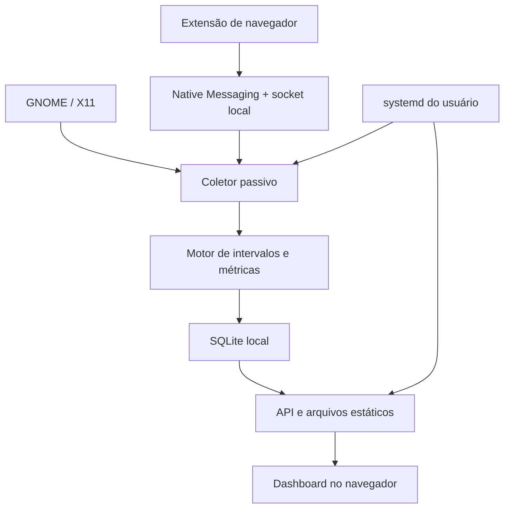

# DigitalMirror — system design

Versão 0.2 · 06/10/2026. Contrato de métricas: [product-spec.md](product-spec.md).
Execução obrigatória via Docker/Compose: [ADR-007](adr/007-docker-compose.md).

## 5. System design

### 5.1 Arquitetura

COL, ENG e API são módulos de um único processo Python no contêiner desktop em
produção. O Native Messaging usa bridge no contêiner somente enquanto o navegador
do host mantém conexão, com launcher shell no host planejado no EP-06. Uma conexão
SQLite escritora tem dono único; leituras usam conexões próprias. Uvicorn roda com
um worker, sem reload. O navegador do host renderiza o dashboard sob demanda.

Dockerfile possui alvos runtime/development; Compose tem dev (checks sem rede,
workspace, sem sessão) e desktop (sockets da sessão explicitamente montados,
filesystem read-only, tmpfs, capabilities removidas). UID/GID preservam o usuário
do host; rootless usa 0 internos, mapeados ao usuário sem privilégios. Imagens
recebem dependências no build; não instalar Python/venv no host.

**ADR-001: aplicação local, sem servidor externo.** Histórico e API funcionam offline. O observador não envia telemetria à internet.

**ADR-002: monólito modular Python.** Evita serviços e runtimes adicionais. Interfaces dos adaptadores permitem substituir comandos por APIs nativas quando as medições exigirem.

**ADR-003: intervalos como base de verdade.** Observações pequenas alimentam intervalos contíguos; não guardamos 17.280 screenshots ou eventos de teclado por dia. Armazenamos mudanças e fechamentos periódicos.

**ADR-004: funções de métricas puras.** Recebem calendário, intervalos e versão da política; retornam totais reproduzíveis. API não contém fórmulas independentes.

**ADR-005: foco global como padrão.** Monitor principal é dimensão de filtro, sem substituir foco. Uma opção “somente monitor principal” terá denominador e rótulo próprios.

**ADR-007: Docker/Compose obrigatório.** Substitui execução Python direta. X11,
GNOME, logind e navegador observados continuam no host; não executar desktop virtual.
Não montar home, /proc ou Docker socket nem usar privileged/xhost +. Socket
read-only não restringe métodos X11/D-Bus: a passividade vem dos comandos permitidos.

### 5.2 Coletor da sessão

O adaptador X11 consulta `_NET_ACTIVE_WINDOW`, `WM_CLASS`, `_NET_WM_PID`, `_NET_WM_NAME`, geometria e workspace. PID/classe são preferidos a inferências pelo título. Usa conexão persistente ao X11; `xdotool`/`xprop` são ferramentas de diagnóstico e fallback, com timeout. Não executar comandos de mutação.

Idle usa a extensão XScreenSaver ou uma ferramenta equivalente como `xprintidle` no protótipo. Bloqueio usa a interface D-Bus da sessão GNOME, verificada no spike inicial; fallback para `LockedHint` da sessão logind quando disponível. Suspensão usa eventos `PrepareForSleep` e retomada via logind, sem chamar métodos que alterem a sessão. A disponibilidade e permissões de cada fonte serão verificadas no Debian real antes de fixar o adaptador.

Monitores são consultados via XRandR. A janela é atribuída ao monitor com a maior área de interseção. Um empate usa regra determinística; monitor principal é atributo separado. Mudanças de resolução/dock invalidam o cache. Coordenadas não são persistidas como telemetria de entrada.

O ciclo coleta snapshot a cada 5 s; eventos de foco e bloqueio podem encerrar intervalos antes. Leituras síncronas usam uma thread dedicada e deadlines, sem bloquear a API. Após reconexão, requer novo snapshot; nunca reutiliza indefinidamente o anterior.

### 5.3 Duração, gaps e relógios

1. UTC identifica instantes; o calendário usa `zoneinfo` e datas locais.
2. Um relógio monotônico mede duração dentro da execução. Registrar também `CLOCK_BOOTTIME` e boot ID, quando disponíveis, para detectar suspensão e mudança de boot.
3. Amostras válidas consecutivas com intervalo até 10 s permitem estimativa por manutenção do estado anterior. Mudanças detectadas por evento usam seu instante; mudanças descobertas por polling têm precisão nominal de até 5 s com fontes saudáveis.
4. Quando a lacuna excede 10 s, atribuir no máximo 5 s ao estado anterior e marcar o restante UNKNOWN, salvo evento confiável que explique o intervalo. Não estender automaticamente a última aba pelo gap.
5. Dividir intervalos no limiar de idle quando a evolução é conhecida e consistente. Uma queda em idle indica interação em algum instante; calcular esse instante quando válido e marcar a precisão estimada.
6. Saltos do relógio de parede geram fronteira e diagnóstico. Não criar duração negativa, sobreposição ou compensação artificial.
7. Crash encerra cobertura no último checkpoint; no próximo início, a lacuna é reconstruída como UNKNOWN. Usar chave idempotente e transação para evitar duplicação.

Estado não mudou: atualizar intervalo aberto/checkpoint no máximo a cada 30 s. Estado mudou: encerrar e iniciar em transação. Fechamento normal grava imediatamente; perda máxima desejada em crash abrupto é 30 s, claramente sinalizada.

### 5.4 Abas e domínios

A extensão observa ativação/atualização de aba, foco de janela e encerramento. Obtém URL para extrair apenas hostname; não transmite caminho, query, conteúdo da página ou histórico de abas inativas. Navegações na mesma aba podem criar segmentos de hostname diferentes.

Payload mínimo: `schema_version`, `browser_instance_id`, `profile_instance_id`, `sequence`, `browser_window_id`, `tab_session_id`, `focused`, `hostname`, `incognito`, `observed_at` e título transitório opcional. O backend usa horário de recebimento para integrar à linha do tempo; números de sequência eliminam duplicatas e rejeitam mensagens antigas. IDs de sessão evitam colisão quando o navegador recicla tab IDs.

Chrome/Chromium usa Manifest V3 e Native Messaging. O host é restrito aos IDs de extensão registrados e encaminha mensagens para um socket Unix privado em `$XDG_RUNTIME_DIR/digitalmirror/`. Conferir UID do peer, limitar mensagem a 16 KiB e aplicar schema. O canal persistente permite heartbeat solicitado pelo host a cada 30 s; não depender de um `setInterval` permanente no service worker. Reabrir conexão e enviar snapshot após reconexão.

Para creditar duração a uma aba, exigir: sessão desbloqueada, navegador com foco no X11, janela do navegador focada reportada pela extensão, identificação inequívoca da instância/janela e snapshot fresco, com validade máxima de 45 s. IDs da API de navegador não são XIDs. Correlação usa instância, família de processo e, quando autorizado, título transitório normalizado; múltiplos candidatos iguais resultam em UNKNOWN. O spike valida os casos com dois perfis e dois navegadores antes de assumir cobertura completa.

Se a extensão falhar, o tempo de navegador continua registrado por app, e o detalhamento fica como `aba desconhecida`. Modo privado não recebe hostname nem título. Se a extensão não estiver habilitada no modo privado, o backend não pode identificá-lo com certeza: tratar esse trecho como navegador sem metadados, sem inferir domínio. Firefox usa uma implementação compatível e manifesto próprio na versão seguinte.

### 5.5 Dados

| Tabela | Campos essenciais e papel |
| --- | --- |
| `schema_migrations` | Versão da estrutura |
| `policy_versions` | Configuração efetiva, thresholds, calendário e versão do motor |
| `collector_runs` | Run ID, boot ID, início/fim, última confirmação e motivo |
| `intervals` | ID, início/fim UTC, estado, app, aba efêmera, hostname, monitor, origem, qualidade e política |
| `annotations` | Almoço, reunião, pausa, início/fim declarados, origem e revisão |
| `day_overrides` | Exceções de jornada, almoço, dias úteis e ausências |
| `classification_rules` | Apps/domínios, categoria, prioridade e versão |
| `bucket_rollups` | Início do bloco, dimensões, segundos por estado, cobertura e revisão |
| `daily_rollups` | Totais diários, denominadores, horários e versão do cálculo |

Índices por início/fim e data local derivada. SQLite em WAL, foreign keys habilitadas, transações curtas e cache limitado. Intervalos são a verdade enquanto retidos; rollups são derivados e podem ser reconstruídos. Alterar almoço invalida os agregados do dia. Alterar classificação não reescreve telemetria: gera nova revisão dos agregados e deixa visível a política aplicada.

Depois da exclusão de detalhes, os agregados permanecem consultáveis, mas não prometemos recalcular regras que exigem os detalhes removidos. A UI informa quando isso ocorrer. Exportar default sem títulos, com timezone, unidade e versão de métrica.

### 5.6 API local proposta

| Método e rota | Contrato |
| --- | --- |
| `GET /api/v1/health` | Estado do processo, fontes, últimas coletas e backlog |
| `GET /api/v1/days/{date}/summary` | Totais, E/D/P/O, percentuais, horários, qualidade e versões |
| `GET /api/v1/days/{date}/timeline` | Intervalos paginados; detalhes limitados ao período retido |
| `GET /api/v1/days/{date}/buckets` | Blocos de 5 min e composição por estado |
| `GET /api/v1/days/{date}/apps` | Tempo por app, incluindo desconhecido |
| `GET /api/v1/days/{date}/tabs` | Tempo por aba efêmera e domínio |
| `GET /api/v1/history?from=&to=` | Resumo limitado a no máximo 180 dias |
| `PUT /api/v1/settings` | Validar e criar versão de configuração |
| `POST /api/v1/annotations` | Criar marcação manual com ID idempotente |
| `POST /api/v1/collector/pause` | Pausar coleta explicitamente |
| `POST /api/v1/collector/resume` | Retomar com novo snapshot |
| `GET /api/v1/export?date=&format=` | Download CSV/JSON com metadados |
| `DELETE /api/v1/data?from=&to=` | Excluir período após ação explícita na tela |

Datas são `YYYY-MM-DD` no fuso configurado; tempos em segundos; percentuais com nomes explícitos. Respostas incluem `as_of`, `provisional`, `coverage_pct`, `metric_version` e `policy_version`. Sem dados são null ou coleção vazia com motivo, não zeros fabricados.

Bind somente em `127.0.0.1`. Validar Host e Origin, sem CORS genérico. Dados de leitura também exigem sessão local para evitar exposição a páginas externas. Um comando `digitalmirror open` gera token de bootstrap temporário, abre a URL local e o troca por cookie HttpOnly/SameSite; ações mutáveis exigem CSRF token. Nenhum token vai para repositório, exportação ou logs. A credencial protege acesso web; não isola dados contra processos com o mesmo usuário do sistema.

O desktop usa rede host Linux, sem publicar portas, para preservar esse bind.
Docker rootless anterior a Engine 29.5 tem namespace de rede RootlessKit: serve para
o doctor por sockets, mas não garante loopback do host para a futura API. EP-07
exige Engine compatível e teste de bind/acesso/isolamento, sem mudar para 0.0.0.0.

### 5.7 Dashboard

A tela diária oferece data selecionada, estado atual, fontes disponíveis e oito horas previstas. Cards: presença estimada, cobertura, interação recente, tempo bloqueado, tempo sem dados, primeiro horário observado e último horário observado/declarado. Indicadores durante o dia usam a jornada decorrida com rótulo explícito.

Abaixo: timeline com legenda acessível, gráfico horizontal por app, tabela de abas/domínios e grade de blocos de cinco minutos. Clicar em bloco mostra composição em segundos/minutos, cobertura e origem. Filtros: período, app, domínio, categoria e monitor. Detalhes de navegação pertencem ao tempo de browser, evitando somar o mesmo tempo duas vezes.

Controles: começar/encerrar jornada, marcar almoço, reunião ou pausa, pausar observação, configurações e exportar. Histórico compara dias com a cobertura sempre presente. Comparação com números informados do gestor é opcional e não altera métricas medidas. Datas, cores, tabelas e controles devem ser legíveis por teclado; gráficos têm alternativa textual.

O dashboard consulta a cada 30 s, suspende polling quando a página fica oculta e não precisa permanecer aberto. Seu próprio tempo em foco é registrado como navegador/domínio local por padrão; não alteramos silenciosamente os totais para excluí-lo.

### 5.8 Autostart e ciclo de vida

Distribuir imagens e launchers Compose no escopo do usuário. Serviço systemd user
chama Compose a partir da sessão gráfica, com `PartOf=graphical-session.target`,
reinício em falha e backoff. O instalador valida a integração efetiva do GNOME;
`graphical-session.target` não será presumido ativo sem verificar. Se necessário,
XDG autostart inicia o mesmo serviço com ambiente correto. Não usar restart always
como substituto de login/logout nem instalar Python diretamente no host.

Importar `DISPLAY`, `XAUTHORITY` quando presente e o ambiente da sessão D-Bus a partir da sessão real; não fixar `DISPLAY=:0` ou caminho de autoridade. Não habilitar linger como solução para acessar uma sessão ainda inexistente. Um lock de instância evita duplicação caso dois mecanismos de início sejam configurados.

Ligar o computador inicia a sessão de login; a observação pessoal começa automaticamente depois do login gráfico. Antes disso, a sessão do usuário ainda não existe. Não exige abertura manual do programa nem do dashboard. Logout encerra a coleta; novo login cria nova execução. Histórico atravessa reboot.

Locais: configuração em `~/.config/digitalmirror/`, banco em `~/.local/share/digitalmirror/`, socket e segredos temporários em `$XDG_RUNTIME_DIR/digitalmirror/`. Diretórios privados e arquivos de dados com permissões restritas. Logs no journal sem títulos/URLs e com limites de volume.

Os diretórios privados serão bind mounts específicos do runtime no EP-04/08;
não montar o home inteiro. Reiniciar/recriar contêiner preserva dados. Não usar
`docker compose down -v` como rotina de atualização/desinstalação.
Para o spike, o launcher mapeia somente X11/Xauthority e sockets D-Bus da sessão
e sistema. O manager systemd user do host é consultado via GetUnit/ActiveState
por D-Bus, sem depender de systemd rodando dentro do contêiner.

## 6. Metas de qualidade e validação

As metas abaixo serão medidas no Debian do usuário; não são consumo já verificado.

| ID | Meta de aceite |
| --- | --- |
| RNF-01 | Processo principal RSS ≤ 100 MiB em sessão de 8h, dashboard fechado |
| RNF-02 | Principal + bridge ≤ 130 MiB RSS somado, sem incluir o navegador |
| RNF-03 | CPU média ≤ 1% de um núcleo numa sessão representativa; sem crescimento sustentado |
| RNF-04 | Fontes saudáveis: polling de 5s com p95 de atraso ≤ 1s; erro de foco por transição amostral tipicamente ≤ 5s |
| RNF-05 | Resumo diário p95 < 250 ms com 180 dias de agregados e 30 dias de detalhes no fixture de referência |
| RNF-06 | Banco + WAL ≤ 300 MiB após 30 dias com até 2.000 intervalos/dia no fixture de benchmark |
| RNF-07 | Crash abrupto perde no máximo 30s de confirmação e deixa gap identificado |
| RNF-08 | Coleta diária e histórico continuam sem internet |
| RNF-09 | API/socket não acessíveis pela rede local; origens não autorizadas rejeitadas |
| RNF-10 | Totais reconciliam estados, apps e detalhamento de browser sem dupla contagem |

Se o protótipo com subprocessos exceder CPU/memória, migrar o adaptador para conexão nativa antes da entrega. Filas têm limites e métricas de overflow; backpressure não pode consumir memória indefinidamente. Não impor MemoryMax muito baixo e aceitar crashes como forma de cumprir meta.

### Testes relevantes

- Unitários/property tests do recorte em W, almoço, fronteiras de bloco, limiares, denominador zero e conservação de duração.
- Fixtures de mudança de app, duas abas, navegador sem foco, bloqueio, suspensão, crash, gaps, reboot e salto de relógio.
- Contratos da API e mensagens da extensão com versões, schema, duplicatas e ordem.
- Integração em Debian 12/GNOME/X11: duas telas, título opt-in/off, dois perfis, modo privado e ausência de extensão.
- Fluxo completo: iniciar GNOME → serviço automático → usar app/aba → bloquear/desbloquear → consultar dashboard → reiniciar → histórico preservado.
- Segurança local: bind, Host, Origin, CSRF, cookie e IPC privado; payloads inválidos não derrubam o processo.
- Soak de 8h: RSS, CPU, latência, amostras atrasadas e tamanho SQLite/WAL.
